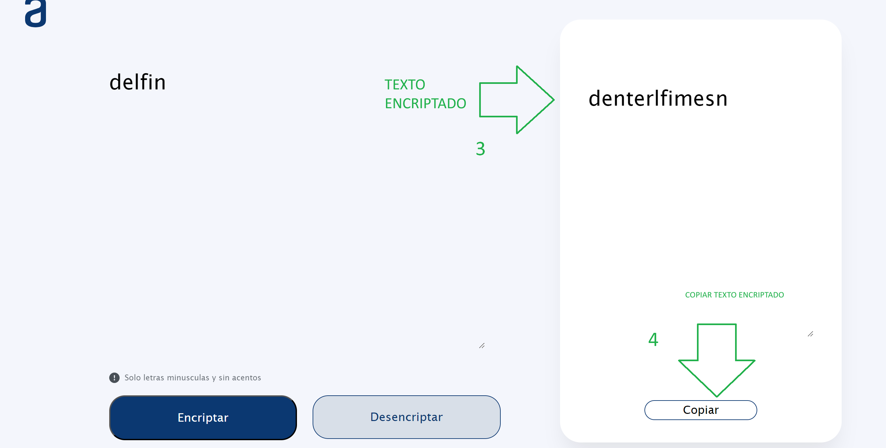
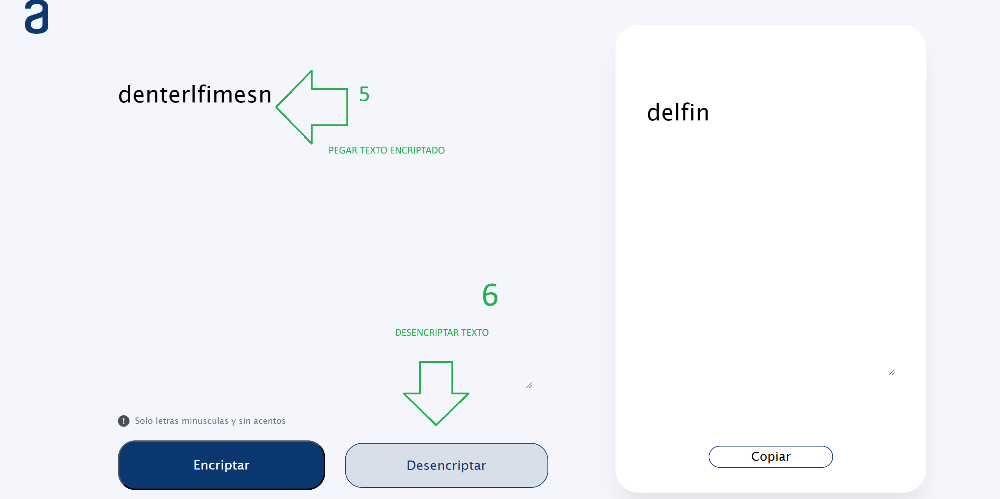

Proyecto final Alura latam formacion de principiante en programacion
# Encriptador de Texto

Este es un proyecto simple de encriptador de texto escrito en JavaScript. Permite encriptar y desencriptar texto, así como copiar el texto encriptado al portapapeles.

## Características

- **Encriptar:** Encripta el texto ingresado.
- **Desencriptar:** Desencripta el texto previamente encriptado.
- **Copiar:** Copia el texto encriptado al portapapeles.

## Requisitos

- Navegador web moderno

## Capturas de Pantalla

## Tecnologías Utilizadas

- HTML
- CSS
- JavaScript

## Autor

- [Sergio Riaño](https://github.com/Sergiovany)
